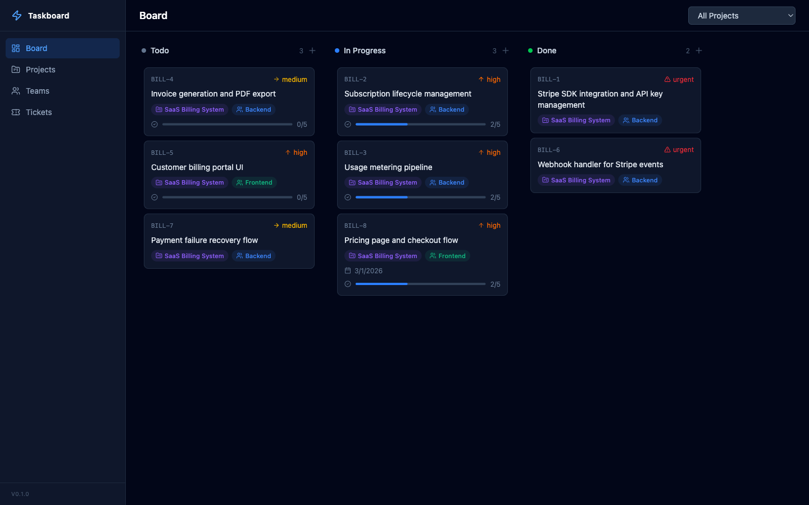
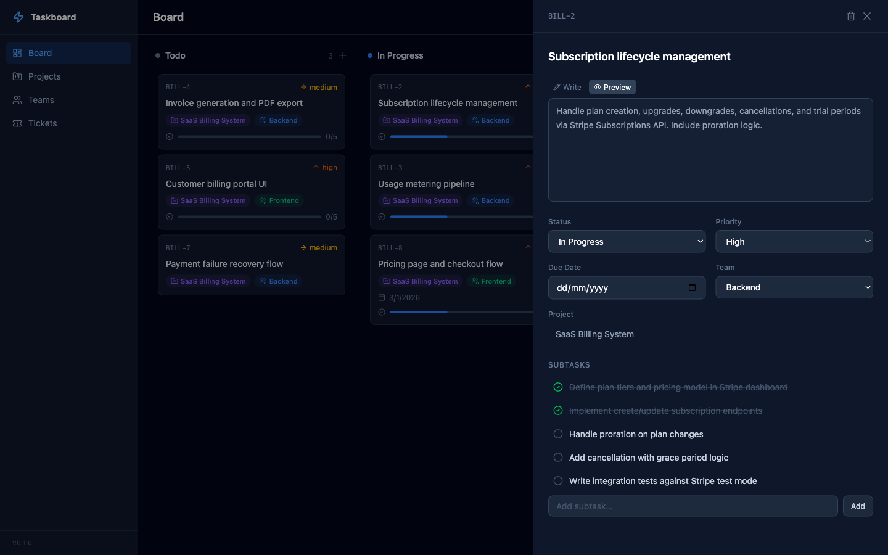
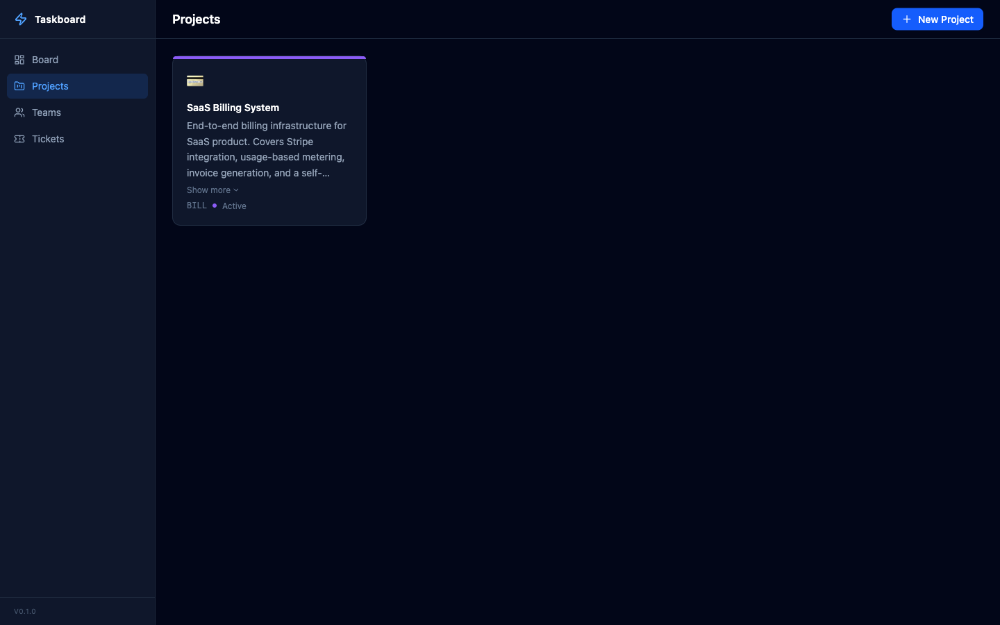
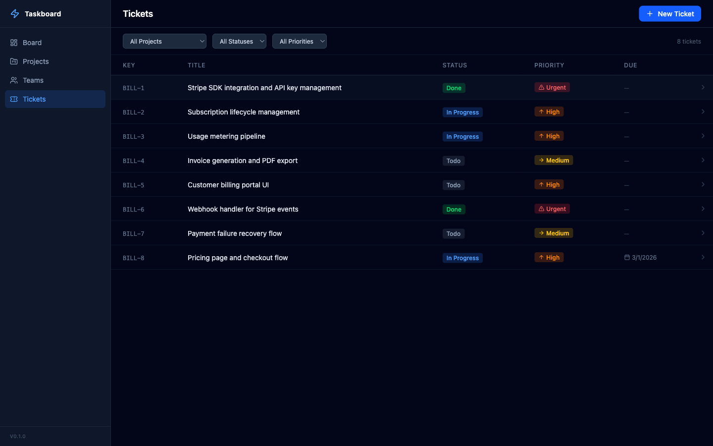
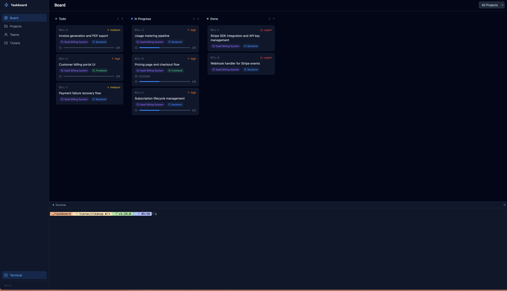

# Taskboard

A local, self-hosted project management tool with a Kanban UI, full CLI, and a built-in [MCP](https://modelcontextprotocol.io/) server that lets AI assistants manage your projects, tickets, and teams directly.

Single binary. SQLite-backed. No Docker, no external database, no runtime dependencies.

## Screenshots





## Features

- **Kanban Board** — drag-and-drop ticket management across Todo, In Progress, and Done columns
- **Projects** — organize work with customizable projects (icons, colors, prefixes)
- **Teams** — assign tickets to teams
- **Tickets** — priority levels, due dates, labels, subtasks, dependencies (blocked by)
- **Embedded Terminal** — run AI coding agents (opencode, Claude Code) directly from the web UI
- **CLI** — manage everything from the terminal
- **MCP Server** — 22 tools for AI-native project management via Model Context Protocol
- **Self-Hosted** — your data stays on your machine in a SQLite database
- **Single Binary** — one `brew install` and you're running

## Install

### Homebrew

```bash
brew tap tcarac/taskboard
brew install taskboard
```

### From source

```bash
git clone https://github.com/tcarac/taskboard.git
cd taskboard
make build
```

Requires Go 1.24+ and Node.js 22+.

## Usage

### Web UI

```bash
taskboard start
# => http://localhost:3010

taskboard start --port 8080
```

### CLI

```bash
taskboard project create "Auth System" --prefix AUTH --icon "🔐"
taskboard project list

taskboard ticket create --project <ID> --title "Implement login" --priority high
taskboard ticket list --project <ID> --status todo
taskboard ticket move <ID> --status done

taskboard team create "Backend"
taskboard team list
```

### MCP Server (for AI assistants)

```bash
taskboard mcp
```

#### Claude Code

```bash
claude mcp add taskboard -- /path/to/taskboard mcp
```

#### Claude Desktop

Add to `~/.claude/claude_desktop_config.json`:

```json
{
  "mcpServers": {
    "taskboard": {
      "command": "/path/to/taskboard",
      "args": ["mcp"]
    }
  }
}
```

#### Data Hierarchy

```
Project → Ticket → Subtask
(initiative)  (task)    (step)
```

- **Projects** are the top-level grouping (like epics/initiatives). Create one per body of work.
- **Tickets** are concrete, actionable tasks within a project. Don't create "epic" tickets — use projects.
- **Subtasks** are checklist steps within a ticket, for breaking work into verifiable pieces.

#### Available MCP Tools (22)

| Tool                    | Description                                      |
| ----------------------- | ------------------------------------------------ |
| **Projects**            |                                                  |
| `list_projects`         | List all projects with optional status filter    |
| `get_project`           | Get project details by ID                        |
| `create_project`        | Create a new project (use for epics/initiatives) |
| `update_project`        | Update project properties                        |
| `delete_project`        | Delete a project and all its tickets             |
| **Teams**               |                                                  |
| `list_teams`            | List all teams                                   |
| `get_team`              | Get team details by ID                           |
| `create_team`           | Create a new team                                |
| `update_team`           | Update team properties                           |
| `delete_team`           | Delete a team                                    |
| **Tickets**             |                                                  |
| `list_tickets`          | List tickets with filters                        |
| `get_ticket`            | Get ticket details with subtasks and labels      |
| `create_ticket`         | Create a ticket (task) within a project          |
| `update_ticket`         | Update ticket properties                         |
| `move_ticket`           | Move ticket to different status column           |
| `delete_ticket`         | Delete a ticket                                  |
| **Board**               |                                                  |
| `get_board`             | Get full Kanban board grouped by status          |
| **Subtasks**            |                                                  |
| `create_subtask`        | Add a subtask to a ticket                        |
| `batch_create_subtasks` | Add multiple subtasks to a ticket at once        |
| `toggle_subtask`        | Toggle subtask completion                        |
| `delete_subtask`        | Remove a subtask from a ticket                   |

#### Example Prompts

Once the MCP is connected, you can talk to your AI assistant in high-level terms and let it figure out the breakdown:

```
I'm building a SaaS billing system. Set up the project and break the work
into tickets covering Stripe integration, usage metering, invoice generation,
and a customer billing portal. Prioritize accordingly.
```

```
I need to ship a password reset flow. Think through what's involved — API
endpoints, email templates, token handling, UI screens, tests — and create
tickets with subtasks for each piece.
```

```
Look at my board and figure out what's blocking progress. If anything in
"in progress" has been sitting there without subtasks, break it down into
concrete next steps.
```

Here's what that looks like — a project and tickets created entirely by an AI assistant via MCP:





### Embedded Terminal

The web UI includes a built-in terminal. Click **Terminal** in the sidebar to open a full PTY shell with color support and a resizable panel. Run `opencode`, `claude`, or any command directly from the browser.



The agent shares the same SQLite database via MCP, so tickets it creates show up on your board immediately.

## Data Storage

All data is stored in a SQLite database at:

- **macOS**: `~/Library/Application Support/taskboard/taskboard.db`
- **Linux**: `~/.config/taskboard/taskboard.db`

Migrations run automatically on first start.

### Custom Database Path

Use `--db` to point any command at a different database file:

```bash
taskboard --db /path/to/other.db start
taskboard --db /path/to/other.db mcp
taskboard --db /path/to/other.db ticket list
```

### Clearing Data

To wipe all projects, tickets, teams, and labels while keeping the schema intact:

```bash
taskboard clear        # prompts for confirmation
taskboard clear -f     # skip confirmation
```

This also respects `--db`, so you can clear a specific database file:

```bash
taskboard --db /tmp/test.db clear -f
```

## Tech Stack

| Layer        | Technology                                          |
| ------------ | --------------------------------------------------- |
| Language     | Go                                                  |
| Database     | SQLite (via modernc.org/sqlite, pure Go)            |
| CLI          | cobra                                               |
| HTTP         | chi                                                 |
| Frontend     | React, TypeScript, Tailwind CSS v4, dnd-kit         |
| Terminal     | xterm.js, gorilla/websocket, creack/pty             |
| MCP          | JSON-RPC over stdio                                 |
| Distribution | Single binary with embedded frontend via `embed.FS` |

## Development

```bash
# Run backend (serves API on :3010)
go run ./cmd/taskboard start

# Run frontend dev server (proxies API to :3010)
cd web && npm run dev

# Build everything
make build

# Clean
make clean
```

## Contributing

See [CONTRIBUTING.md](CONTRIBUTING.md) for guidelines.

## License

[MIT](LICENSE)
